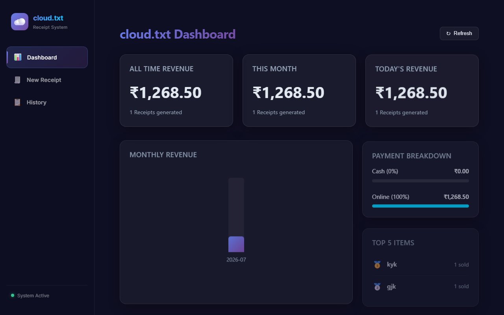
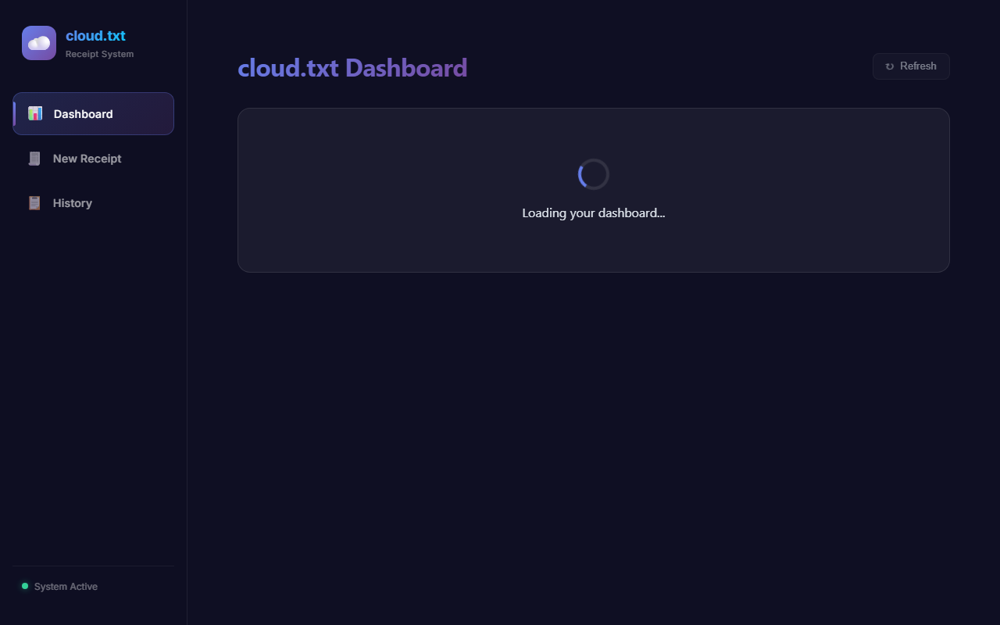
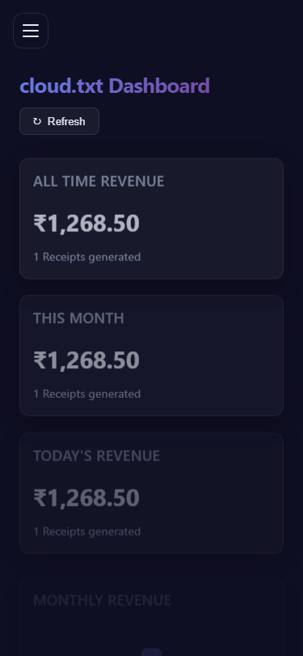

# cloud.txt — Receipt Generator & Dashboard

cloud.txt is a client-serverless customer receipt generator and sales analytics dashboard. It combines a **Google Sheets & Google Drive Backend** (accessible via Apps Script REST APIs) with a **Modern Dark-Themed Glassmorphic Angular SPA** frontend.

## 🏗️ Architecture

```
┌─────────────────────────────────┐
│        Angular Frontend         │
│  (Modern Dark UI / Glassmorphic) │
└───────────────┬─────────────────┘
                │
                │ HTTP POST / GET (JSON)
                ▼
┌─────────────────────────────────┐
│     Google Apps Script API      │
│     (deployed as Web App)       │
└───────────────┬─────────────────┘
                ├──────────────────────────────────┐
                ▼                                  ▼
┌───────────────────────────────┐  ┌───────────────────────────────┐
│       Google Sheets           │  │         Google Drive          │
│       (Data Storage)          │  │       (PDF File Vault)        │
│                               │  │                               │
│  • Receipts sheet             │  │  • Receipts_PDF/ folder       │
│  • Auto-recalculated stats    │  │  • Formatted PDF Receipts     │
└───────────────────────────────┘  └───────────────────────────────┘
```

## 📸 Screenshots

### Desktop View
| Dashboard | Invoicing Form | Transaction History |
| :---: | :---: | :---: |
|  |  |  |

### Mobile View
| Mobile Dashboard |
| :---: |
|  |

## ✨ Key Features

- **Google Sheets Database**: Completely serverless, auto-updating, zero-cost database.
- **Drive PDF Archival**: Generates professionally styled PDF invoices and saves them in Google Drive.
- **Modern Angular Frontend**: Glassmorphic UI with charts, responsive stats, and dynamic receipt forms.
- **Reactive Calculation**: Dynamic item rows addition/removal with live subtotal, GST (18%), and Grand Total updates.
- **Demo Mode**: Works instantly with rich mock data if no Google Apps Script Web App is connected.
- **Double Entry Points**: Native Google Sheets HTML sidebar fallback for backend invoicing.

## 📂 Repository Structure

```text
Angular-Sheets-Receipt-Dashboard/
├── Code.gs                    # Core billing logic, menu setups, & config
├── WebApp.gs                  # REST-like API routes (doGet & doPost) for Angular
├── PDF.gs                     # HEADless sheet-to-PDF export pipeline
├── Dashboard.gs               # Aggregated sales metrics calculators
├── SheetSetup.gs              # Run-once DB initializer & color-styling script
├── FormUI.gs                  # Local HTML Sidebar controller
├── Sidebar.html               # Native Google Sheet sidebar popup UI
├── README.md                  # Main portal with embedded screenshot previews
├── SetupInstructions.md       # Setup guide for sheet admins
│
├── screenshots/               # Playwright-captured application screenshots
│   ├── desktop_dashboard.png
│   ├── desktop_receipt_form.png
│   ├── desktop_receipt_history.png
│   └── mobile_dashboard.png
│
├── docs/                      # Comprehensive technical logs and guidelines
│   ├── PROJECT_REPORT.md      # High-level architecture write-up
│   ├── API_DOCUMENTATION.md   # Endpoint request/response schemas
│   ├── USER_GUIDE.md          # Guide to using both UI options
│   ├── DEPLOYMENT_GUIDE.md    # Script web app & Angular deploy guide
│   ├── technical_report.md    # Formal engineering review
│   ├── development_log.md     # Chronological development milestones
│   ├── decision_log.md        # Architectural choice log
│   ├── project_metrics.md     # Lines of code & prompt stats
│   ├── presentation_outline.md# 11-slide project deck structure
│   ├── reflection.md          # Retro notes & future improvements
│   └── notion_workspace_structure.md  # Schema for Notion engineering board
│
└── angular-app/               # Glassmorphic Dark-Themed Frontend
    ├── angular.json           # Angular CLI configuration
    ├── package.json           # Dependencies (Playwright, Angular CLI, etc.)
    └── src/
        ├── main.ts            # Bootstrapper (configured with Zone.js)
        ├── styles.scss        # Global typography & glassmorphic tokens
        ├── environments/      # Target Apps Script URL endpoints
        └── app/
            ├── app.ts         # Shell layout containing navigation sidebar
            ├── app.routes.ts  # Lazy router links for the views
            ├── services/      # ReceiptService (with Demo Mode mock fallback)
            ├── models/        # Shared data interface models
            ├── dashboard/     # Responsive flex column analytics charts
            ├── receipt-form/  # Live GST (18%) Signals-driven billing form
            └── receipt-history/ # Transaction grid ledger with filters
```

## 📂 Documentation Directory

Full details of the design, timeline, and API specs are available in the `docs/` folder:

- [Project Report](file:///c:/Users/shash/OneDrive/Desktop/Anti_gravity_files/APP_SCRIPT_sheets/docs/PROJECT_REPORT.md)
- [API Documentation](file:///c:/Users/shash/OneDrive/Desktop/Anti_gravity_files/APP_SCRIPT_sheets/docs/API_DOCUMENTATION.md)
- [User Guide](file:///c:/Users/shash/OneDrive/Desktop/Anti_gravity_files/APP_SCRIPT_sheets/docs/USER_GUIDE.md)
- [Deployment Guide](file:///c:/Users/shash/OneDrive/Desktop/Anti_gravity_files/APP_SCRIPT_sheets/docs/DEPLOYMENT_GUIDE.md)
- [Technical Report](file:///c:/Users/shash/OneDrive/Desktop/Anti_gravity_files/APP_SCRIPT_sheets/docs/technical_report.md)
- [Visual Documentation](file:///c:/Users/shash/OneDrive/Desktop/Anti_gravity_files/APP_SCRIPT_sheets/docs/visual_documentation.md)
- [Development Log & Timeline](file:///c:/Users/shash/OneDrive/Desktop/Anti_gravity_files/APP_SCRIPT_sheets/docs/development_log.md)
- [Decision Log](file:///c:/Users/shash/OneDrive/Desktop/Anti_gravity_files/APP_SCRIPT_sheets/docs/decision_log.md)
- [Project Metrics](file:///c:/Users/shash/OneDrive/Desktop/Anti_gravity_files/APP_SCRIPT_sheets/docs/project_metrics.md)
- [Presentation Outline](file:///c:/Users/shash/OneDrive/Desktop/Anti_gravity_files/APP_SCRIPT_sheets/docs/presentation_outline.md)
- [Retrospective Reflection](file:///c:/Users/shash/OneDrive/Desktop/Anti_gravity_files/APP_SCRIPT_sheets/docs/reflection.md)
- [Changelog](file:///c:/Users/shash/OneDrive/Desktop/Anti_gravity_files/APP_SCRIPT_sheets/docs/CHANGELOG.md)

## 🚀 Quick Start

### 1. Setup Apps Script
Copy all files from `APP_SCRIPT_sheets/` (excluding `angular-app/`) into your Google Sheet's Apps Script editor, run `setupAllSheets`, and deploy as a Web App to Anyone.

### 2. Configure Angular
Paste the Web App URL into `angular-app/src/environments/environment.ts`.

### 3. Run Angular
```bash
cd angular-app
npm install
npm run start
```
Open `http://localhost:4200` to interact with your dashboard.\n