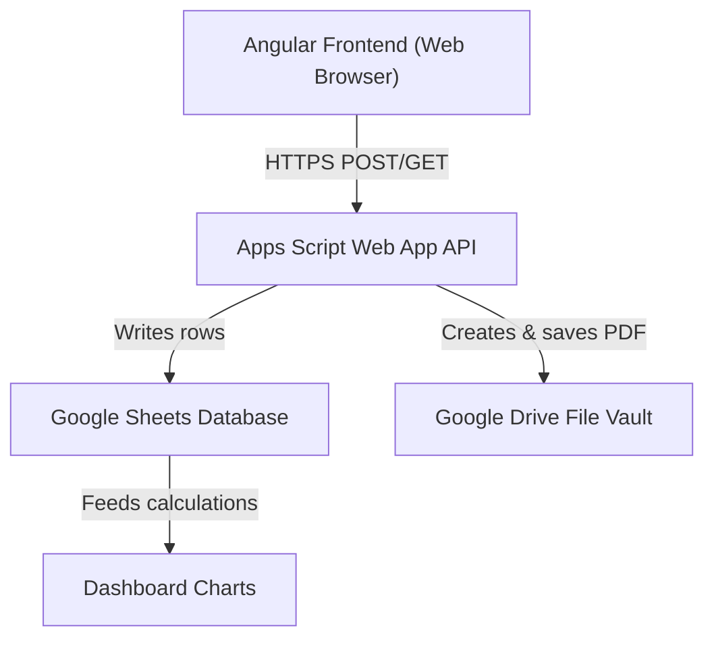

# Visual Documentation — cloud.txt Diagrams

## System Architecture Diagram


## Receipt Generation Sequence
```mermaid
sequenceDiagram
    participant User as Store Admin
    participant Frontend as Angular Frontend
    participant API as Web App API
    participant Sheets as Sheets Database
    participant Drive as Drive Folder

    User->>Frontend: Fills form & clicks Generate
    Frontend->>API: POST /exec {formData}
    API->>Sheets: Append row to 'Receipts'
    API->>Drive: Create formatted PDF in 'Receipts_PDF'
    Drive-->>API: PDF URL
    API-->>Frontend: {success: true, receiptId, pdfUrl}
    Frontend-->>User: Show success & PDF preview link
```\n